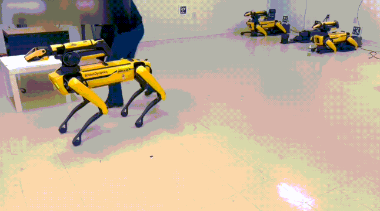

# [CVPRW 2026] UniTac: Whole-Robot Touch Sensing Without Tactile Sensors

**Authors:** [Wanjia Fu<sup>*</sup>](https://wanjia-fu.com/), [Hongyu Li<sup>*</sup>](https://lhy.xyz/), [Ivy He](https://ivyyyy24381.github.io/home), [Stefanie Tellex](https://cs.brown.edu/people/stellex/), [Srinath Sridhar](https://srinathsridhar.com/)

**Affiliations:** Brown University \
**\*Equal contribution**
[](https://arxiv.org/abs/2507.07980)
[](https://ivl.cs.brown.edu/research/unitac)
<p align="center">
  
</p>

**UniTac** enables a robot equipped solely with joint sensors to localize contacts. UniTac allows for potential applications in touchbased human-robot interaction, including scenarios such as bio-inspired quadruped choreography.

## 🚀 Quick Start
### Installation
1. **Clone the repository**

   ```
   git clone git@github.com:julia-fu0528/UniTac.git
   cd UniTac
   ```
2. **Set up virtual environment**

   ```
   python3 -m pip install virtualenv
   python3 -m virtualenv --python=/usr/bin/python3 unitac_env
   source unitac_env/bin/activate
   ```
3. **Install packages**

   ```
   pip install -r requirements.txt
   ```

### Downloads
1. **Third Party**

   The coordinate of ground truth and predicted contact locations are based on the coordinate frame of the robot meshes:
   <details>
   <summary><b>SPOT</b></summary>

   Download SPOT mesh urdf and related meshes [here](https://drive.google.com/drive/folders/1IT3_eVo6WOz9hAca2uvpmRWlpXH9W97E?usp=sharing) into the root directory as /spot_description.
   </details>
   <details>
   <summary><b>FR3</b></summary>

   Download FR3 mesh urdf and related meshes from the [official repository](https://github.com/frankaemika/franka_description/tree/main/robots/fr3) into the root director as /franka_description.
   </details>
2. **Model Checkpoint**:

   If you want to test the model on your robot, you can use the regression model of the Spot as an example. 
   
   Download the [model checkpoint](https://drive.google.com/drive/folders/1gu0QhYxPT4Lt_cYvq38_O4iZJHX51y-0?usp=drive_link) into unitac_net_logs/spot/regression/ of the repository's root.

## 📖 Pipeline Overview

### Run individual steps

1. **Data Collection**:

   ```
   cd scripts/

   python store_robot_state.py 
          --markers_path your_marker_path 
          --output_dir your_output_path 
          --robot_type spot_or_franka --duration 2 
          --hostname xxx.xxx.xxx.xxx
   ```

2. **Data Preprocessing**:

   ```
   python dataset.py 
          --session spot_dataset 
          --data_dir ../data --markers_path your_marker_path 
          --seq 1 --robot_type spot_or_franka
   ```
3. **Training**:

   ```
   python train.py 
          --session spot_dataset --data_dir ../data 
          --markers_path  your_marker_path 
          --device "gpu" --seq 1 --robot_type spot_or_franka
   ```
4. **Online Prediction**:
   
   Online prediction can produce either visualizations of contact localization or corresponding physical Human Robot Interactions:

   <details>
   <summary><b>Without physical Human Robot Interaction</b></summary>

   ```bash
   python predict.py 
          --ckpts_path ../unitac_net_logs/spot/regression/version_0/checkpoints/best.ckpt 
          --markers_path your_marker_path --data_dir ../data/spot_dataset 
          --device cpu --seq 1 --robot_type spot_or_franka 
          --hostname xxx.xxx.xxx.xxx
   ```
   </details>
   <details>
   <summary><b>With physical Human Robot Interaction</b></summary>

   ```bash
   python predict.py 
          --ckpts_path ../unitac_net_logs/spot/regression/version_0/checkpoints/best.ckpt 
          --markers_path your_marker_path --data_dir ../data/spot_dataset 
          --device cpu --seq 1 --robot_type spot_or_franka 
          --hostname xxx.xxx.xxx.xxx 
          --choreo 
          --choreography-filepaths ../choreo/lay_down.txt ../choreo/sit.txt
                                   ../choreo/pace_right.txt ../choreo/pace_left.txt
                                   ../choreo/turn_left_back.txt ../choreo/turn_right_front.txt 
                                   ../choreo/turn_right_back.txt ../choreo/turn_left_front.txt
                                   ../choreo/tilt_left_back.txt ../choreo/tilt_left_front.txt 
                                   ../choreo/tilt_right_back.txt ../choreo/tilt_right_front.txt
                                   ../choreo/step_back_left.txt ../choreo/step_back_right.txt 
                                   ../choreo/step_front_left.txt ../choreo/step_front_right.txt
                                   ../choreo/play_bow.txt ../choreo/play_bow_happy.txt

   ```

### Run Everything

   ```
   sh scripts/run.sh
   ```

## 📚 Citations

If you find UniTac useful in your research, please cite our paper:

```bibtex
@article{fu2025unitac,
      title={UniTac: Whole-Robot Touch Sensing Without Tactile Sensors}, 
      author={Fu, Wanjia and Li, Hongyu and He, Ivy X. and Tellex, Stefanie and Sridhar, Srinath},
      journal={arXiv preprint arXiv:2507.07980},
      year={2025}
}
```
